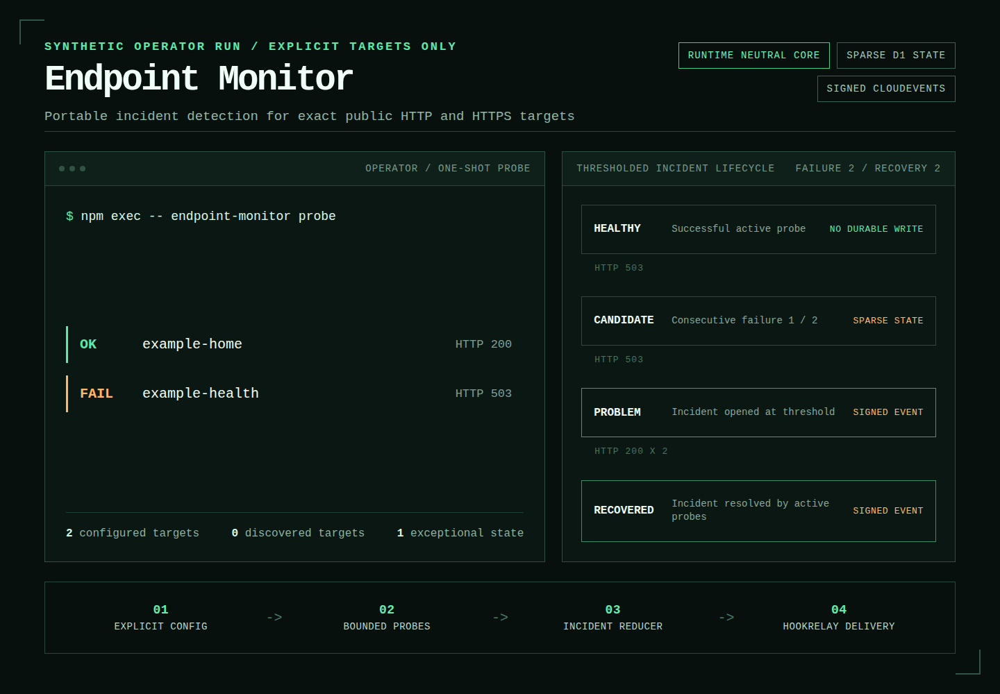

# Endpoint Monitor

Endpoint Monitor detects failures on an explicit set of public HTTP and HTTPS URLs and emits incident transitions for downstream alerting. It does not discover targets, assume hostname routing, or remediate failures.

The monitoring core is runtime-neutral JavaScript. The included Cloudflare Workers adapter adds deterministic Cron scheduling, exceptional-state-only D1 persistence, Workers Observability logs, optional Cloudflare edge analytics, and signed CloudEvents delivery through Hookrelay.



## Why explicit targets

Traffic, DNS inventory, and provider metadata do not define what should be monitored. They can include retired hosts, external fetch destinations, alternate routes, and hostnames whose useful path is not `/`. Endpoint Monitor therefore treats the configuration file as the only enrollment authority. Provider data may corroborate a configured target but cannot add one.

## Installation

Endpoint Monitor ships as one indivisible package: `@j-256/endpoint-monitor` contains the controller CLI, runtime-neutral monitoring core, Cloudflare Worker, D1 migrations, and deployment templates. Install it into a small operator project rather than globally so the controller always deploys the Worker and migrations from the exact installed version.

GitHub Releases contain an installable `j-256-endpoint-monitor-X.Y.Z.tgz` archive and `SHA256SUMS`. Download both assets, verify the checksum, then create an operator project:

```sh
shasum -a 256 -c SHA256SUMS
mkdir endpoint-monitor-service
cd endpoint-monitor-service
npm init -y
npm install --save-exact /path/to/j-256-endpoint-monitor-X.Y.Z.tgz
npm exec -- endpoint-monitor init
```

When npm registry publication is enabled, only the install line changes:

```sh
npm install --save-exact @j-256/endpoint-monitor
```

The remaining `init`, bootstrap, and deploy commands are identical. The controller and service will not be published separately. See [Releases](docs/releases.md) for artifact contents, GNU checksum verification, versioning, and the maintainer procedure.

## Quick start

Use Node.js 22 or newer. `endpoint-monitor init` creates three local files: an editable target document, a mode-0600 operator profile, and `.gitignore` entries that keep the target document, profile, generated Wrangler configuration, and Wrangler state out of version control.

Edit `endpoint-monitor.json`, then validate and probe it without durable writes:

```sh
npm exec -- endpoint-monitor config validate
npm exec -- endpoint-monitor targets
npm exec -- endpoint-monitor probe
```

Add `--json` to `config validate`, `targets`, or `probe` for machine-readable output. A failed target makes `probe` exit with status 1. Both `npm exec -- endpoint-monitor help <command>` and `npm exec -- endpoint-monitor <command> --help` show command help.

From a source checkout, run `npm ci` and substitute `node src/cli.mjs` for `npm exec -- endpoint-monitor` when developing the package itself.

## Configuration

```json
{
  "schemaVersion": 2,
  "defaults": {
    "failureThreshold": 2,
    "method": "GET",
    "probeIntervalMinutes": 5,
    "recoveryThreshold": 2,
    "timeoutMilliseconds": 10000
  },
  "targets": [
    {
      "expect": {
        "bodyIncludes": "Example Domain",
        "contentType": "text/html"
      },
      "expectedStatuses": [200],
      "id": "example-home",
      "url": "https://example.com/"
    },
    {
      "expect": {
        "contentType": "application/json",
        "jsonSubset": {
          "ok": true
        }
      },
      "expectedStatuses": [200],
      "id": "example-health",
      "url": "https://status.example.net/health"
    },
    {
      "expect": {
        "location": {
          "url": "https://example.org/docs?probe=1"
        }
      },
      "expectedStatuses": [301],
      "id": "example-redirect",
      "url": "https://old.example.org/docs?probe=1"
    }
  ]
}
```

`id` is the stable incident and scheduling identity. It must be a lower-case DNS-style label. `url` must use a public DNS hostname, may include an exact path and query, and may not include credentials or a fragment. Do not place credentials in query parameters because complete URLs are retained in protected status and incident records.

`method` is `GET` or `HEAD`. Redirects are not followed, so the configured host and route are what the probe verifies. `failureThreshold`, `recoveryThreshold`, and `timeoutMilliseconds` may be overridden per target.

By default, any response below HTTP 500 proves reachability. HTTP 520 through 526 and 530 open an incident immediately; other server responses and network failures use `failureThreshold`. Supply `expectedStatuses` only when the endpoint has a narrower application contract. Only successful active probes can resolve an incident.

Schema version 1 remains accepted for status-only documents. Schema version 2 adds the optional `expect` object:

- `contentType` matches the media type case-insensitively and ignores parameters such as `charset`
- `bodyIncludes` requires one non-empty text marker of at most 1,024 bytes
- `jsonSubset` recursively requires the configured object properties while allowing extra response properties; configured arrays match exactly
- `location` resolves the response header against the target URL and compares normalized URL components; set `ignoreQuery` to `true` only when query differences are intentionally irrelevant

Location validation requires explicit 3xx `expectedStatuses`. Body validation requires `GET`. Status is checked before other expectations. Text markers are searched within at most the first 64 KiB and stop the read as soon as they match; JSON validation requires a complete body within that limit. Read content is discarded immediately and never included in diagnostics. A failed expectation records the observed HTTP status plus a fixed error code and follows the configured failure threshold.

## Cloudflare deployment

The Cloudflare adapter uses one Cron trigger per minute. A stable hash distributes targets across `probeIntervalMinutes`, with at most 10 probes and five concurrent outbound connections per invocation. Configuration that cannot satisfy that cadence is rejected rather than silently probed less often. The adapter also enforces a 45-external-subrequest budget and uses manual redirects. Review the [Workers limits](https://developers.cloudflare.com/workers/platform/limits/) before deploying on a different plan or after changing these bounds.

Set the account-scoped deployment credentials that Wrangler and the controller already recognize:

```sh
export CLOUDFLARE_ACCOUNT_ID="your-32-character-account-id"
export CLOUDFLARE_API_TOKEN="your-account-api-token"
```

Preview the complete resource plan without local, provider, or durable writes. A safe first configuration enables active monitoring while leaving analytics, status, and delivery disabled:

```sh
npm exec -- endpoint-monitor cloudflare bootstrap --enabled --dry-run
```

Bootstrap creates one D1 database, writes the ignored mode-0600 `wrangler.jsonc`, records the resource in the operator profile, and applies the migrations bundled with the installed package. Supply `--database-id <uuid>` to adopt an existing D1 database instead. Rerunning bootstrap reuses the recorded database and preserves selected features.

```sh
npm exec -- endpoint-monitor cloudflare bootstrap --enabled
```

The operator profile remembers the absolute target-document and Wrangler-configuration paths but contains no target values, resource identifiers, or secrets. `wrangler.jsonc` contains the D1 identifier and feature flags but no secrets or targets.

Check the exact installed Worker bundle, then deploy. A live deploy applies pending migrations, synchronizes the current target document into D1, publishes the Worker, resolves its account `workers.dev` hostname, and retries the public `/healthz` endpoint before succeeding:

```sh
npm exec -- endpoint-monitor deploy --dry-run
npm exec -- endpoint-monitor deploy
```

Routine target changes do not require remembering the D1 identifier or deployment flags:

```sh
npm exec -- endpoint-monitor config path
npm exec -- endpoint-monitor config validate
npm exec -- endpoint-monitor targets
npm exec -- endpoint-monitor probe
npm exec -- endpoint-monitor config sync
```

`config path` identifies the active target document. `targets` lists its explicit IDs, methods, status and response contracts, and URLs. Profile-backed `config validate`, `targets`, and `probe` use that document automatically; all three accept an explicit target-document argument for ad hoc use. After editing, probe it locally and run `config sync`; synchronization validates the complete document, reads the existing generated D1 binding, and writes only when the configuration fingerprint changed. No Worker deployment is required for target-only changes. Use `--profile <path>` with profile-backed commands to select a non-default operator profile.

Apply every packaged migration before using incident triage commands. The CLI reads the D1 binding from the same operator profile and authenticates directly to Cloudflare with `CLOUDFLARE_ACCOUNT_ID` and `CLOUDFLARE_API_TOKEN`:

```sh
npm exec -- endpoint-monitor incidents list
npm exec -- endpoint-monitor incidents show <incident-id>
npm exec -- endpoint-monitor incidents acknowledge <incident-id> -n "Under investigation"
npm exec -- endpoint-monitor incidents snooze <incident-id> -u 2026-08-28T03:00:00Z -n "Maintenance window"
npm exec -- endpoint-monitor incidents dismiss <incident-id> -n "False positive"
```

`incidents list` shows open incidents by default; add `-a, --all` for resolved history and `-l, --limit` to bound the result. Acknowledgement records review without changing health or delivery. Snooze delays an undelivered problem transition until its future RFC 3339 deadline but does not stop probes or retract an event already sent. Dismissal records an audited `operator-dismissed` resolution, clears exceptional state, and emits a resolved transition only when a corresponding problem transition exists. If the target is still failing, it can reopen after its configured threshold; remove or correct the target instead when the monitoring contract itself is obsolete. Operator notes are stored in D1, so keep credentials and private response content out of them.

Install only the secrets required by selected features through concealed Wrangler input:

```sh
npm exec -- wrangler secret put CLOUDFLARE_API_TOKEN --config wrangler.jsonc
npm exec -- wrangler secret put ENDPOINT_MONITOR_HOOKRELAY_URL --config wrangler.jsonc
npm exec -- wrangler secret put ENDPOINT_MONITOR_HOOKRELAY_HMAC --config wrangler.jsonc
npm exec -- wrangler secret put ENDPOINT_MONITOR_STATUS_TOKEN --config wrangler.jsonc
```

Rerun bootstrap to select optional features, then deploy again. Existing selections are retained when their flags are omitted:

```sh
npm exec -- endpoint-monitor cloudflare bootstrap --analytics --status
npm exec -- endpoint-monitor deploy
```

Add `--analytics` for optional Cloudflare analytics. Add `--delivery` only after the Hookrelay subscription is live. If Hookrelay is another Worker in the same account, add `--hookrelay-service <worker-name>` to use a service binding; otherwise delivery uses the public HTTPS route.

The target document is stored in D1 rather than an environment variable because Workers cap individual variables at 5 KB. See [Cloudflare operation](docs/cloudflare.md) for shadow verification, Observability fields, and cutover guidance.

## Storage behavior

Every enabled invocation reads one configuration row and the small exceptional-state set. A healthy target with no candidate or incident causes no D1 write. Repeated failures for an already-open incident also cause no write. D1 changes are limited to configuration changes, failure or recovery candidates, incident transitions, explicit operator triage actions, unique provider signals, delivery attempts, suppression after configuration changes, and periodic retention cleanup.

At one Cron invocation per minute, the Worker receives 1,440 scheduled invocations per day regardless of target count. The actual probe total is controlled by the target interval. Workers Observability carries invocation health, CPU time, wall time, subrequest count, and compact run summaries without turning routine success into D1 history.

## Hookrelay events

Delivery uses structured CloudEvents 1.0 with source `urn:endpoint-monitor` and these types:

- `urn:endpoint-monitor:problem:v1`
- `urn:endpoint-monitor:recovered:v1`

The exact serialized body is signed as `X-Hookrelay-Signature-256: sha256=<hex>` using HMAC-SHA256. An outbox retries failed delivery with bounded exponential backoff and holds a resolved transition until its corresponding problem transition has been delivered. Incidents opened while delivery is disabled are bridged into the outbox when delivery is enabled, so shadow mode does not lose an ongoing problem. Operator-dismissed incidents use the recovered event type with `resolutionReason: "operator-dismissed"` so downstream consumers can close the existing problem without mistaking the action for a successful probe.

## HTTP and diagnostics

`GET /healthz` returns only service liveness. `/api/status` is hidden unless status is enabled and requires `Authorization: Bearer <ENDPOINT_MONITOR_STATUS_TOKEN>`. Its protected response includes target URLs, schedule capacity, exceptional states, incidents, acknowledgement and snooze summaries, and delivery backlog. Incident mutation remains available only through the operator CLI.

Custom logs contain fixed event names, target IDs, statuses, bounded error codes, counts, and incident IDs. They exclude URLs, query strings, response headers, exception messages, Hookrelay paths, signatures, HMACs, API response bodies, and secret values.

## Portability

The core configuration, scheduler, probes, reducer, event model, and Hookrelay signing code do not depend on Cloudflare. A different runtime adapter supplies scheduling, exceptional-state persistence, delivery, and an HTTP implementation. See [Architecture](docs/architecture.md) for the adapter contract.

## Development

```sh
npm run check
```

`npm run check` runs the complete local release gate, including package smoke installation and validation of the committed portfolio cover. Install Playwright Chromium with `npx playwright install chromium`, then run `npm run capture:cover` to regenerate `docs/screenshots/cover.png` from its tracked synthetic HTML scene.

See the [changelog](CHANGELOG.md), [release procedure](docs/releases.md), and [contribution guidance](CONTRIBUTING.md). The project is licensed under [AGPL-3.0-only](LICENSE).
